# MLOps Demo: Getting Started Guide

This repo provides a high level overview of steps required to provision the MLOps Demo resources using the [Red Hat Demo Platform](https://demo.redhat.com) to host an OpenShift cluster.

## Deploying The Demo

The MLOps demo is provisioned in multiple steps, each step is run from a script contained in a git repo. 

The reason for separate git repos is that each one contains a core unit of work which can be used as a template for customizing specific requirements for your environment at a later date if required.

### Step One: Request a Cluster from RHPDS

Login to the [Red Hat Demo Platform](https://demo.redhat.com), then navigate to `Catalog` > `Workshops`. In the filter option enter the text: `OpenShift 4.11`, then select the `OpenShift 4.11 Workshop` from the card list below. Finally, click the `Order` button to begin provisioning the new cluster.

Enter required information for Activity and Purpose. Select a geo-region closest to you, such as `us-east-2`. Suggest leaving the other options at defaults unless you would like to specifically enable or disable them.

The cluster will be created usually within an hour or so, and you should receive emails with links to access the cluster along with login credentials.

### Step Two: Bootstrap the MLOps OpenShift Cluster GitOps Repo

Clone the [openshift-cluster-bootstrap-gitops](https://github.com/rh-datascience-and-edge-practice/openshift-cluster-bootstrap-gitops.git) repository.

Before running the script to start setting up the cluster, you will need a Sealed Secret to unlock existing sealed secrets needed for this demo.

The master sealed secret secret will be stored in the following location:

```
bootstrap/base/sealed-secrets-secret.yaml
```

This file cannot be checked into git.  If you do not have this file, you will need to obtain it from a member of the Red Hat Data Science and Edge Practice.

Login to the cluster with the `oc` command line utility and execute the bootstrap script to begin the installation process:

```sh
./bootstrap.sh
```

> **Warning**
>
> If you receive a prompt asking you if you would like create a new Master Sealed Secret key STOP.  You will need the correct Master Sealed Secret key mentioned previously for this demo.

When prompted to select a bootstrap folder, choose the overlay that matches your cluster version, for example: `bootstrap/overlays/rhpds-4.11/`.

The `bootstrap.sh` script will now install the OpenShift GitOps Operator, create an ArgoCD instance once the operator is deployed in the `openshift-gitops` namespace, then bootstrap a set of ArgoCD applications to configure the cluster.

Once the script completes, verify that you can access the ArgoCD UI using the URL output by the last line of the script execution. This URL should present an ArgoCD login page, showing that it was successfully deployed.

Alternatively you can also obtain the ArgoCD login URL from the ArgoCD route:

```sh
oc get routes openshift-gitops-server -n openshift-gitops
```

Use the OpenShift Login option and sign in with your OpenShift credentials.

The cluster may take 10-15 minutes to finish installing and updating.

> **Note**
>
> Sometimes the `openshift-data-foundation-operator` will go to a sync failed state.  This generally doesn't cause any issues that impact the demo, but can be easily resolved by triggering a Sync on the application again.


### Step Three: Bootstrap the MLOps Demo Tenant GitOps Repo

Clone the [mlops-demo-tenant-gitops](https://github.com/rh-datascience-and-edge-practice/mlops-demo-tenant-gitops) repository and run the bootstrap script.

```sh
./bootstrap.sh
```

Additional ArgoCD Application objects will be created in OpenShift GitOps to be synced. You can follow the progress of the sync using the same URL as the previous step. This sync should complete in a few seconds.

This repository will setup our application teams (tenant) environment, including several namespaces, a namespace scoped instance of ArgoCD, and all of the RBAC settings needed for the project.

### Step Four: Bootstrap the MLOps Demo Application GitOps Repo

Clone the [mlops-demo-application-gitops](https://github.com/rh-datascience-and-edge-practice/mlops-demo-application-gitops.git) repository and run the bootstrap script.

```sh
./bootstrap.sh
```

This script will create several ArgoCD Application objects in the tenant ArgoCD instance and not the cluster openshift-gitops instance. Utilize the ArgoCD URL at the bottom of the script to follow the progress of the sync.

Once the sync is complete the demo environment is ready to go.

> **Note**
>
> Currently there is a hardcoded URL in the following pipeline object for the Kubeflow UI that is used in the iris-training pipeline:
>
> `components/tekton/pipelines/iris-training/base/iris-training-pipeline.yaml`
>
> You can update the URL at this point in time and push the update to the git repo.  If you do not, when triggering the pipeline during the demo, you will need to manually provide the correct URL at that point in time.  
>
> In future updates this URL will be replaced with the service URL for the Kubeflow UI.  Currently the Kubeflow UI utilizes a self signed cert that is not trusted by the Tekton Pipeline.

## Running the Demo

### Deploy the inference service
At this point our model is trained and ready to be deployed.
You can access the model training notebook by cloning the following project:

[rh-datascience-and-edge-practice/mlops-demo-iris-inference-service](https://github.com/rh-datascience-and-edge-practice/mlops-demo-iris-inference-service/tree/main/models)

In the following steps, we will: 

- create an image with the trained model:
[iris-model.pkl](https://github.com/rh-datascience-and-edge-practice/mlops-demo-iris-training-service)

- Deploy the image to Dev, Test, and Production environments

Create an image from the model by running the Openshift pipeline generated for you:

1. Login to the openshift console https://console-openshift-console.apps.cluster-**guid**.**guid**.**sandbox**.opentlc.com
  
2. From the projects, select `mlops-demo-pipelines`

  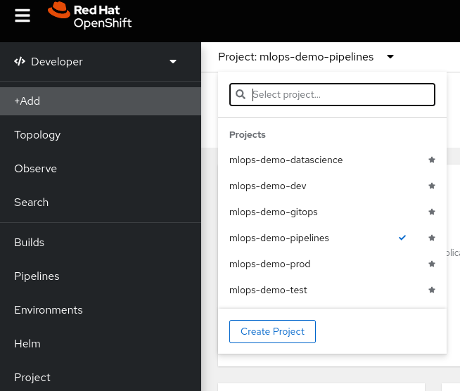
  
3. From the left menu, select the pipelines option.

  
  
4. Select the `iris-inference-service` pipeline

5. From the options in the top right corner, select the Start option.

  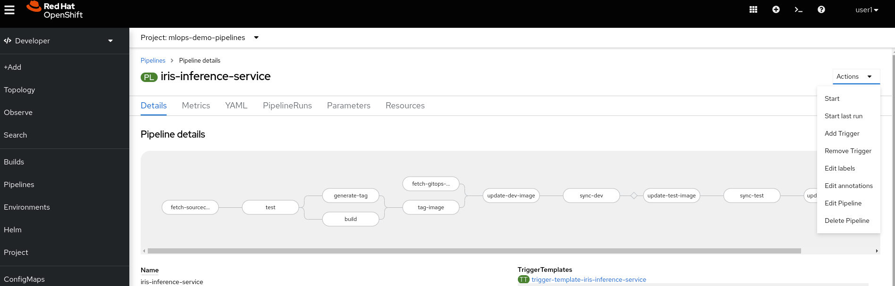
  
6. In the *start pipeline* modal, you will leave most of the parameters as __default__, except for the **Workspaces**

  6.1. Set the `sourcecode-workspace` and `gitops-workspace` as `VolumeClaimTemplate`
  
  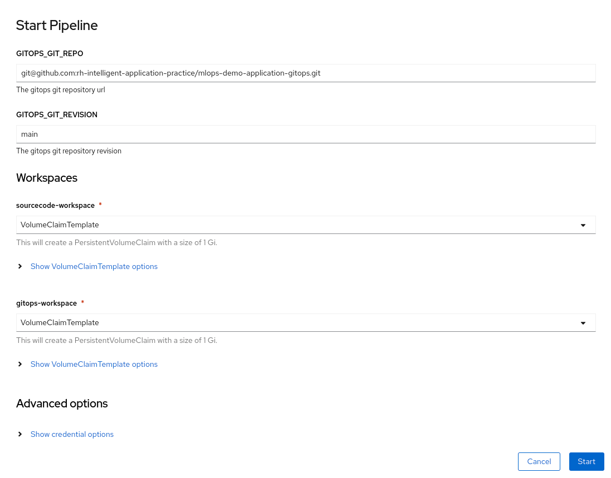
  
  6.2. In the `Show VolumeClaimTemplate options` for `sourcecode-workspace`, set the size to 5 GB
  
  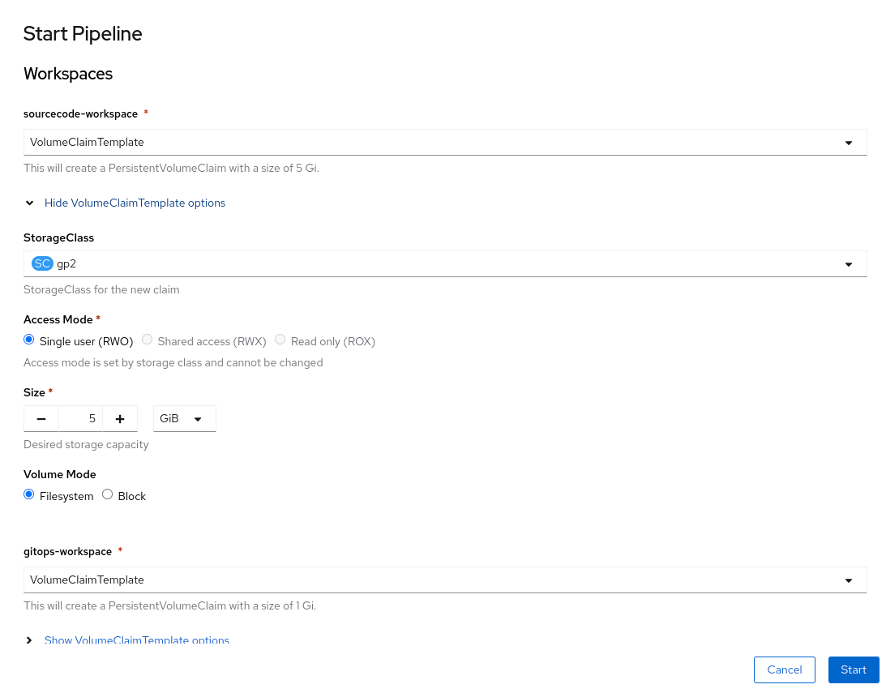
  
7. Click the Start button, and monitor the pipeline to its completion

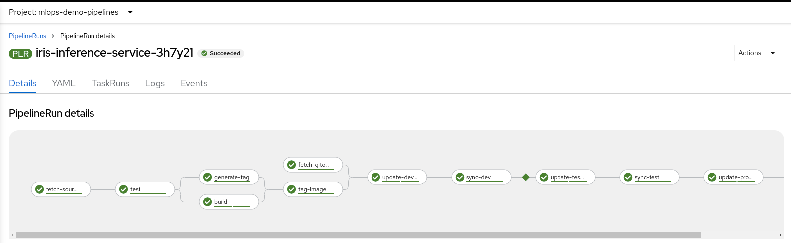

8. Login to ArgoCD, and validate that all applications are synchronized.

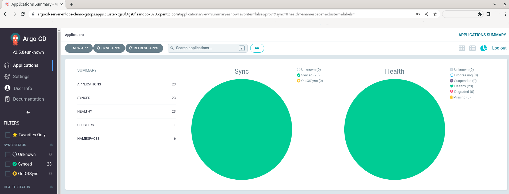

### Grafana dashboard

1. Navigate to the grafana route: https://grafana-route-mlops-demo-dev.apps.cluster-**guid**.**guid**.**sandbox**.opentlc.com

2. use the following credentials to login as Grafana administrator: `grafana_admin:r3dh4t1!`

3. From the left panel, select `Dashboards > manage`

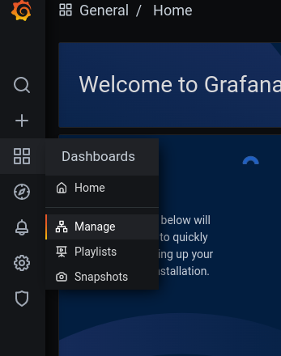

4. In the dashboards folders, locate and select the `mlops-demo-dev > Prediction Analytics` dashboard

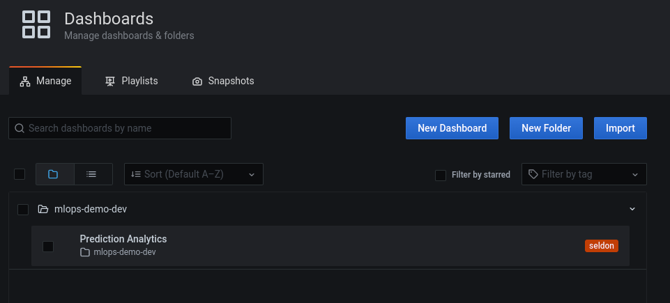

5. Observe the available dashboards.

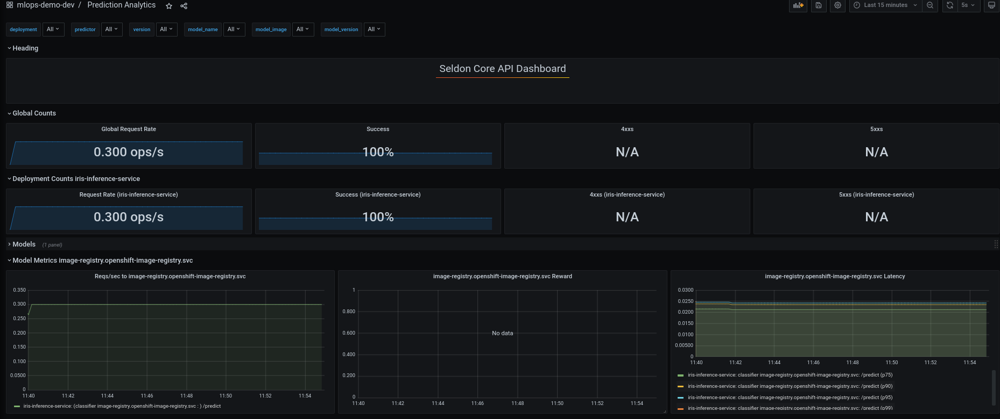

### Use the prediction service

1. Open the following Jupyter notebook with your favorite IDE: [mlops-demo-iris-inference-service/notebooks/seldon-request.ipynb](https://github.com/rh-datascience-and-edge-practice/mlops-demo-iris-inference-service/blob/main/notebooks/seldon-request.ipynb)

```
template for URL:
https://iris-inference-service-mlops-demo-dev.apps.cluster-GUID.GUID.SANDBOX.opentlc.com
```

2. Modify the 4th cell to provide your deployed cluster URL

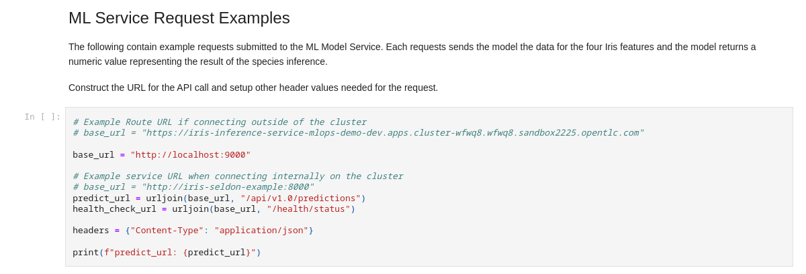

3. Run all the cells to send different requests to the inference service.

### Kafka data producer

Explore the kafka data producer:

1. Login to the Openshift web console.
2. Using the topology diagram for the `mlops-demo-dev` namespace, locate the `iris-message-generator` component

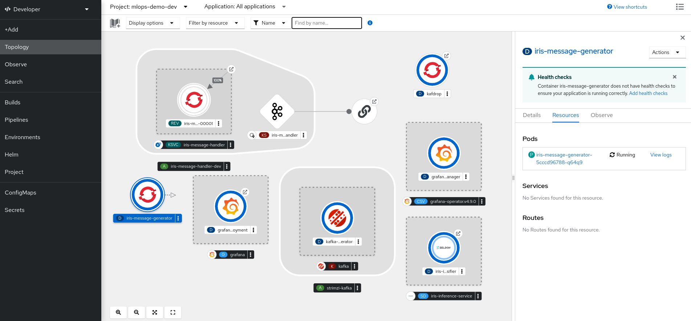


3. Observe the `iris-message-generator` pod logs, and observe how every 10 seconds, a new record is generated.

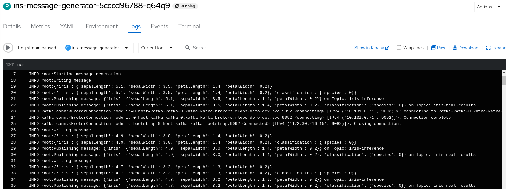


> **_NOTE:_**  Under construction, see https://app.smartsheet.com/sheets/R52PR9x25fGrjrXwMpCGGmqRRw64vCHgvwchR2p1?rowId=5098253884974980

## Repos

The MLOps demo consists of a number of git repositories:

### GitOps Repos

- Cluster Bootstrap: [openshift-cluster-bootstrap-gitops](https://github.com/rh-datascience-and-edge-practice/openshift-cluster-bootstrap-gitops) - bootstraps an OpenShift cluster with several operators and other components that are utilized for Machine Learning.

- Tenant GitOps: [mlops-demo-tenant-gitops](https://github.com/rh-datascience-and-edge-practice/mlops-demo-tenant-gitops) - project structure for a team of application developers that require several namespaces for deploying and managing an application.

- Application GitOps: [mlops-demo-application-gitops](https://github.com/rh-datascience-and-edge-practice/mlops-demo-application-gitops) - resources that are deployed and managed by the application team.

### Application Repos

- Iris Training Service: [mlops-demo-iris-training-service](https://github.com/rh-datascience-and-edge-practice/mlops-demo-iris-training-service) - this repo contains source code for training the Iris machine learning model.

- Iris Inference Service: [mlops-demo-iris-inference-service](https://github.com/rh-datascience-and-edge-practice/mlops-demo-iris-inference-service) - this repo contains source code for deploying the Iris machine learning model using a custom Seldon wrapper.

### Other Repos

- Helm Charts: [rh-datascience-and-edge-practice/helm-charts](https://github.com/rh-datascience-and-edge-practice/helm-charts) - this repo is designed to create a space to build, maintain, and version custom helm charts that can be reused by multiple projects. This repo will automatically build and publish charts using GitHub Pages.
